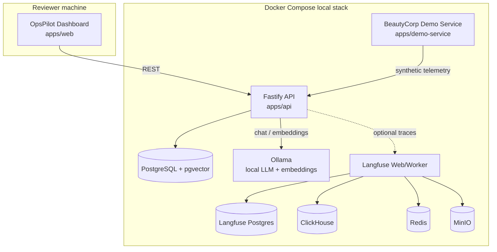
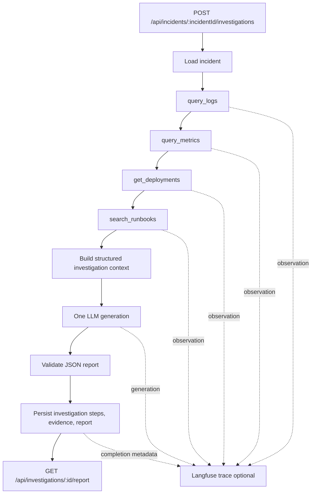
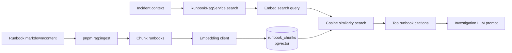
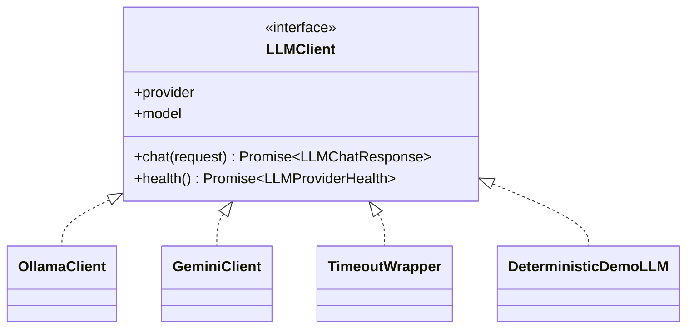
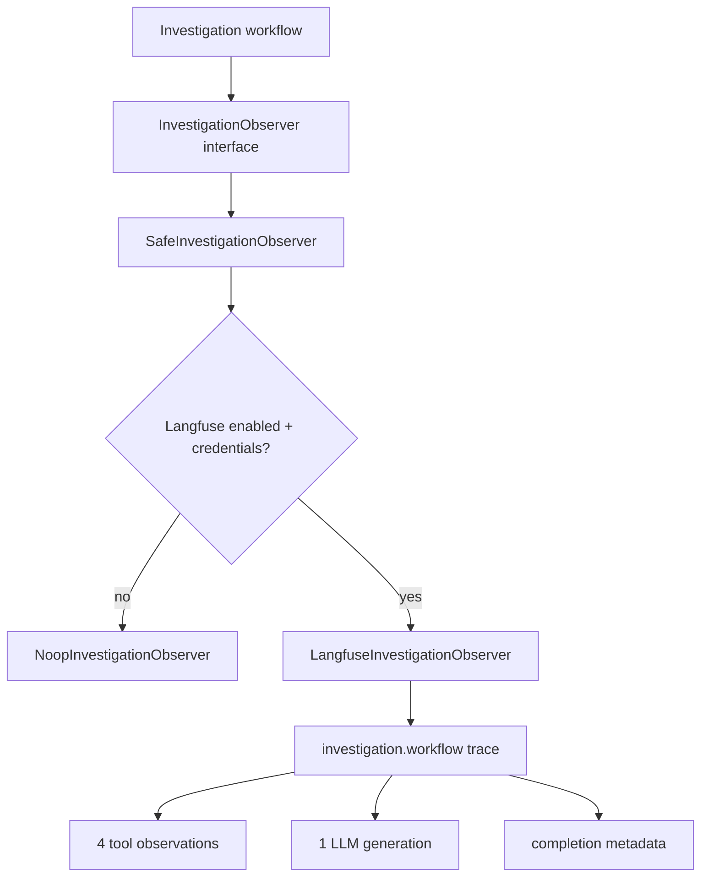
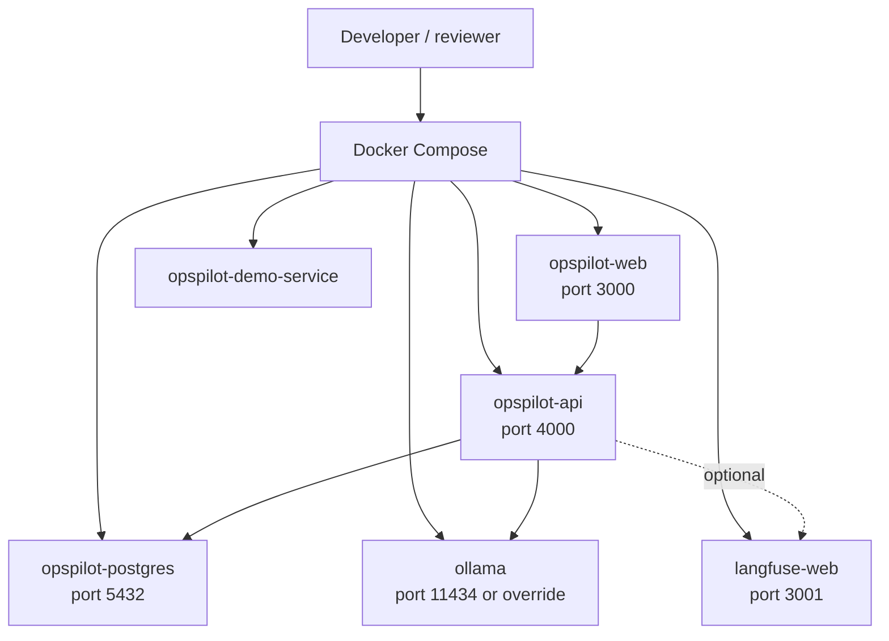
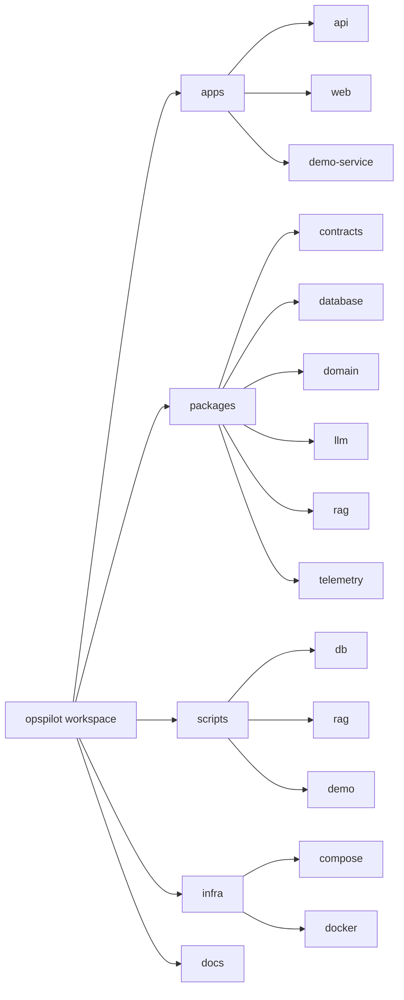

# OpsPilot Architecture

This document is the diagram-first architecture index for OpsPilot v1.0.0. It reflects the implementation in `main` at RC1.

## Overall system

## Investigation workflow

The workflow is deterministic up to the LLM call. OpsPilot does not run a planner loop, autonomous retries, remediation, or tool selection in V1.

## RAG flow

Default embeddings use Ollama. Deterministic embeddings exist for local smoke tests.

## LLM provider abstraction

Provider-specific behavior stays inside `packages/llm`. The API depends on the `LLMClient` boundary, not on a concrete provider.

## Langfuse integration

Langfuse is additive. If it is disabled or unavailable, the investigation still completes and persists through OpsPilot's own read model.

## Deployment architecture

V1 is Docker Compose only. Kubernetes, Terraform, ArgoCD, and cloud hosting are intentionally future scope.

## Package structure

## Source-of-truth docs

- [`database-schema.md`](database-schema.md)
- [`runbook-rag.md`](runbook-rag.md)
- [`llm-provider-abstraction.md`](llm-provider-abstraction.md)
- [`langfuse-observability.md`](langfuse-observability.md)
- [`../adr/0001-monorepo.md`](../adr/0001-monorepo.md)
- [`../adr/0002-langfuse-observability.md`](../adr/0002-langfuse-observability.md)
